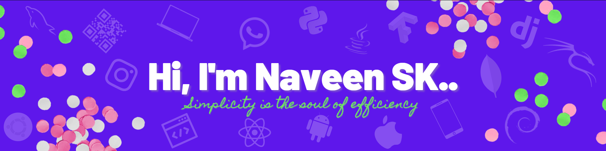

<h2 align="center">A CyberSec enthusiast, from Tamil Nadu, India.</h2>

###

<h2 align="left">Stats:</h2>

###

  
  

###

<h2 align="left">Skills:</h2>

###

###

  
  
  
  
  
  
  
  
  
  
  
  
  
  
  
  
  
  
  
  
  
  
  
  
  
  
  
  
  
  

###

 

<h2 align="left">Contributions:</h2>

###

 

###

<h2 align="left">Let's Talk:</h2>

###

 

  
  
  
  

###

<h3 align="center">Guests Visited:</h3>

###

  

###

  

###

<!--
**Naveen2004/Naveen2004** is a ✨ _special_ ✨ repository because its `README.md` (this file) appears on your GitHub profile.

Here are some ideas to get you started:

- 🔭 I’m currently working on ...
- 🌱 I’m currently learning ...
- 👯 I’m looking to collaborate on ...
- 🤔 I’m looking for help with ...
- 💬 Ask me about ...
- 📫 How to reach me: ...
- 😄 Pronouns: ...
- ⚡ Fun fact: ...
-->
